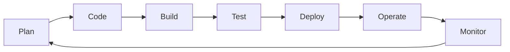
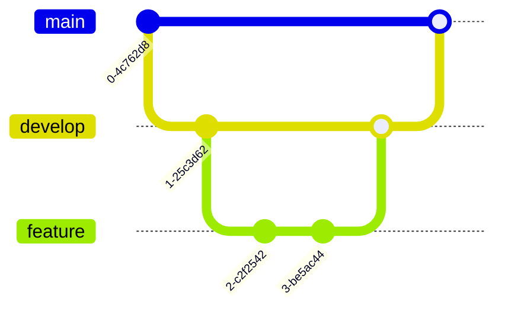
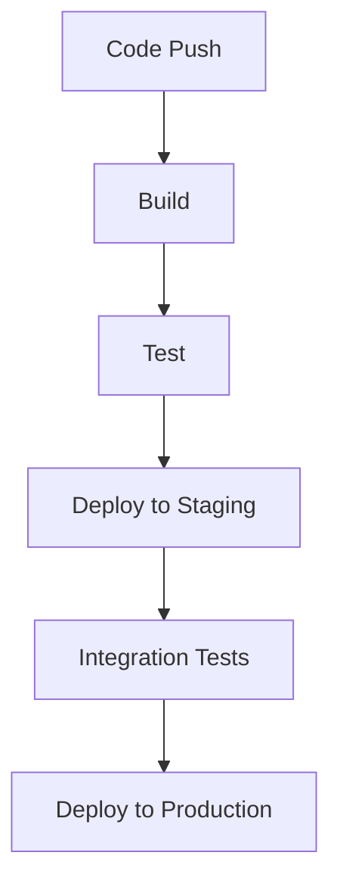
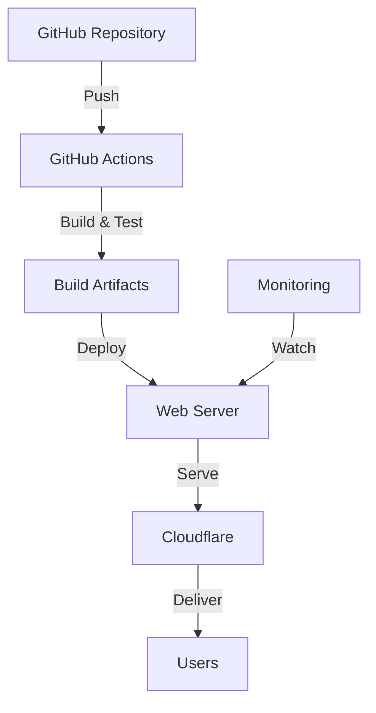
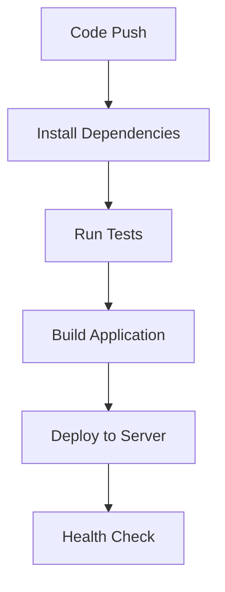

<style>
.with-overlay::before {
  content: '';
  position: absolute;
  top: 0;
  left: 0;
  width: 100%;
  height: 100%;
  background: rgba(0, 0, 0, 0.8); /* Adjust the opacity as needed */
  z-index: -1;
}

.footer {
  position: absolute;
  bottom: 20px;
  display: flex;
  justify-content: center;
  gap: 6px;
  left: 20px;
  left: 50%;
  transform: translateX(-50%);
  text-align: center;
  color: #fff;
}


.footer a {
  color: #fff;
  text-decoration: underline;
}
.footer img {
  border-radius: 50%;
  width: 80px;
  height: 80px;
  object-fit: cover;

}

.footer .name {
  font-size: 20px;
  font-weight: bold;
}

.name-container{
  justify: center;
}
.footer .job-description {
  font-size: 16px;
}
.small-code {
  font-size: 0.8em;
}
</style>

# DevOps Fundamentals
### A Comprehensive Guide for Beginners

<div class="pt-12">
  <span @click="$slidev.nav.next" class="px-2 py-1 rounded cursor-pointer custom-button" hover="bg-white bg-opacity-10">
    Press Space for next page <carbon:arrow-right class="inline"/>
  </span>
</div>

<div class="footer">
  
  <div class="name-container">
  <div class="name">Benjamin Oguntoye</div>
  <div class="job-description">DevOps Enginer <a href="https://pageit.io">@Pageit</a></div>
  </div>
</div>

<!--
Welcome to our comprehensive DevOps training course. This presentation covers fundamental concepts and practical skills.
-->

---
layout: intro
---

# Course Overview
<div class="py-4"></div>
<div class="grid grid-cols-2 gap-4">

<div>

## What We'll Cover
- DevOps Fundamentals
- Linux Essentials
- Version Control
- CI/CD Pipelines
- Best Practices
- Hands-on Exercises

</div>

<div>

## Learning Objectives
- Understand DevOps principles
- Master essential tools
- Implement automation
- Deploy applications
- Monitor systems

</div>

</div>

---
# layout: two-cols
---

# What is DevOps?

<div class="mt-4">

DevOps is a set of practices that combines software development (Dev) and IT operations (Ops) to:


<v-clicks>

- 🚀 Shorten development lifecycle
- 🔄 Enable continuous delivery
- 💪 Ensure high software quality
- 🤝 Foster collaboration

</v-clicks>

<v-after>
<div class="pl-4 mt-12">

</div>
</v-after>
</div>


---
layout: default
---

# Core DevOps Principles

<div class="grid grid-cols-3 gap-4 mt-8">

<div v-click class="p-4 bg-blue-500 bg-opacity-10 rounded">
  <carbon:continuous-integration class="text-3xl mb-2 text-blue-400"/>
  <h3 class="text-blue-400">Continuous Integration</h3>
  <p class="text-sm">Frequently merge code changes into a central repository</p>
</div>

<div v-click class="p-4 bg-green-500 bg-opacity-10 rounded">
  <carbon:delivery class="text-3xl mb-2 text-green-400"/>
  <h3 class="text-green-400">Continuous Delivery</h3>
  <p class="text-sm">Automate software release process</p>
</div>

<div v-click class="p-4 bg-purple-500 bg-opacity-10 rounded">
  <carbon:cloud-monitoring class="text-3xl mb-2 text-purple-400"/>
  <h3 class="text-purple-400">Monitoring</h3>
  <p class="text-sm">Continuous system observation and improvement</p>
</div>

</div>

---
layout: default
---

# DevOps Tools Ecosystem

<div class="grid grid-cols-3 gap-4 mt-4">

<div v-click class="p-4 border rounded">
  <h3 class="text-blue-400">Version Control</h3>
  <ul class="text-sm mt-2">
    <li>Git</li>
    <li>GitHub</li>
    <li>GitLab</li>
  </ul>
</div>

<div v-click class="p-4 border rounded">
  <h3 class="text-green-400">CI/CD</h3>
  <ul class="text-sm mt-2">
    <li>Jenkins</li>
    <li>GitHub Actions</li>
    <li>CircleCI</li>
  </ul>
</div>

<div v-click class="p-4 border rounded">
  <h3 class="text-purple-400">Containers</h3>
  <ul class="text-sm mt-2">
    <li>Docker</li>
    <li>Kubernetes</li>
    <li>Podman</li>
  </ul>
</div>

<div v-click class="p-4 border rounded">
  <h3 class="text-yellow-400">Infrastructure</h3>
  <ul class="text-sm mt-2">
    <li>Terraform</li>
    <li>Ansible</li>
    <li>CloudFormation</li>
  </ul>
</div>

<div v-click class="p-4 border rounded">
  <h3 class="text-red-400">Monitoring</h3>
  <ul class="text-sm mt-2">
    <li>Prometheus</li>
    <li>Grafana</li>
    <li>ELK Stack</li>
  </ul>
</div>

<div v-click class="p-4 border rounded">
  <h3 class="text-orange-400">Cloud</h3>
  <ul class="text-sm mt-2">
    <li>AWS</li>
    <li>Azure</li>
    <li>GCP</li>
  </ul>
</div>

</div>

---
layout: section
---

# Linux Fundamentals
Essential Commands for DevOps Engineers

---

# Essential Linux Commands

<div class="grid grid-cols-2 gap-4">

<div>

## File Operations
```bash
# List files
ls -la

# Change directory
cd /path/to/dir

# Create/Remove directories
mkdir new_dir
rmdir empty_dir

# Copy/Move files
cp source dest
mv old_name new_name
```

</div>

<div>

## System Operations
```bash
# Check system resources
top
htop

# View disk space
df -h
du -sh *

# Process management
ps aux
kill <pid>
```

</div>

</div>

---
layout: two-cols

---

# User Management


<div class="mt-4">


## Commands
```bash
# Add new user
sudo useradd username

# Set password
sudo passwd username

# Add to group
sudo usermod -aG group username

# Switch user
su - username
```

</div>

<div class="mt-2">

## Explanation of 775:
- Owner: Full read, write, and execute (rwx = 7).
- Group: Full read, write, and execute (rwx = 7).
- Others: Read and execute only (r-x = 5).
</div>

::right::

<div class="mt-14 mx-2">

## File Permissions
```bash
# Change ownership
chown user:group file

# Modify permissions
chmod 755 file

# Permission structure
rwx rwx rwx
│   │   └── Others
│   └────── Group
└────────── Owner
```
</div>

---
layout: default
---

# Package Management

<div class="grid grid-cols-2 gap-4">

<div>

## APT (Debian/Ubuntu)
```bash
# Update package list
apt update

# Install package
apt install package-name

# Remove package
apt remove package-name

# Search packages
apt search keyword
```

</div>

<div>

## YUM/DNF (RHEL/CentOS)
```bash
# Update package list
yum update

# Install package
yum install package-name

# Remove package
yum remove package-name

# Search packages
yum search keyword
```

</div>

</div>

---
layout: default
---

# Version Control with Git

<div class="grid grid-cols-2 gap-4">

<div>

## Basic Commands
```bash
# Initialize repository
git init

# Stage changes
git add .

# Commit changes
git commit -m "message"

# Push to remote
git push origin main
```

</div>

<div>

## Branching Strategy


</div>

</div>

---
layout: default
---

# Advanced Git Operations

<div class="grid grid-cols-2 gap-4">

<div>

## Branching & Merging
```bash
# Create branch
git checkout -b feature

# Merge branch
git merge feature

# Rebase branch
git rebase main

# Cherry-pick commit
git cherry-pick commit-hash
```

[git detailed turorial](https://www.alexeble.de/talks/git-most-wanted/26)
</div>

<div>

## Collaboration
```bash
# Fetch updates
git fetch origin

# Pull changes
git pull origin main

# Create PR
gh pr create

# Review PR
gh pr review
```

</div>

</div>

---
layout: two-cols
---

# CI/CD Pipeline Implementation

<div class="mt-4">

## GitHub Actions Workflow
```yaml
name: CI/CD Pipeline

on:
  push:
    branches: [ main ]
jobs:
  build:
    runs-on: ubuntu-latest

    steps:
    - uses: actions/checkout@v2
    - name: Setup Node.js
      uses: actions/setup-node@v2
    - name: Install dependencies
      run: npm install
    - name: Run tests
      run: npm test
```

</div>

::right::

<div class="mt-4">

## Pipeline Stages



</div>

---
layout: default
---

# Best Practices

<div class="grid grid-cols-2 gap-4">

<div>

## Code Management
- Use version control
- Write clean code
- Document thoroughly
- Review code regularly
- Follow style guides

</div>

<div>

## DevOps Practices
- Automate everything
- Monitor continuously
- Test extensively
- Deploy frequently
- Maintain security

</div>

</div>

---
layout: default
---

# Monitoring and Logging

<div class="grid grid-cols-2 gap-4">

<div>

## Key Metrics
- System performance
- Application health
- Error rates
- Response times
- Resource usage

</div>

<div>

## Tools
```bash
# Prometheus queries
rate(http_requests_total[5m])

# Grafana dashboard
grafana-cli dashboard install

# ELK Stack
filebeat setup
```

</div>

</div>

---
layout: section
---

# Practice Time
CI/CD pipeline and deploying an app
---
layout: cover
---

# Overview

<div class="grid grid-cols-2 gap-4">

<div>

## Topics Covered
- Server Requirements
- GitHub Repository Setup
- CI/CD Pipeline
- Nginx Configuration
- DNS Management
- Deployment Verification

</div>

<div>

## Learning Objectives
- Understand deployment architecture
- Set up secure CI/CD pipelines
- Configure web servers
- Manage DNS and SSL
- Monitor deployments

</div>

</div>

---
layout: center
class: "text-center"
---

# Hands-on Exercise

<div class="grid grid-cols-2 gap-4 mt-8">

<div class="text-left">

## Task
Create a simple CI/CD pipeline that:
1. Builds a react application
2. Runs unit tests
3. Deploys to staging
4. Runs integration tests
5. Deploys to production

</div>

<div class="text-left">

## Solution Template
```yaml
name: Exercise Pipeline
on: [push]
jobs:
  pipeline:
    runs-on: ubuntu-latest
    steps:
      - uses: actions/checkout@v2
      # Add your steps here
```

</div>

</div>

---
layout: default
---

# Exercise Server Deployment Overview

<div class="grid grid-cols-2 gap-4">

<div>

## Basic Requirements
- 2+ CPU cores
- 2GB+ RAM
- 20GB+ SSD storage
- Ubuntu 22.04 LTS
- Secure SSH access

</div>

<div>

## Architecture Overview


</div>

</div>

---
layout: two-cols
---

# GitHub Repository Setup

<div class="mt-4">

## Repository Structure
```bash
├── .github/
│   └── workflows/
│       └── deploy.yml
├── src/
│   ├── __test__/
├── ├── components/
│   ├── hooks/
│   └── types/
├── tests/
└── package.json
```

## Branch Protection
```yaml
main:
  - Require pull request reviews
  - Require status checks
  - No force push
  - Include administrators
```

</div>

::right::

<div class="mt-4">

## github Secrets
- `DEPLOY_HOST`
- `DEPLOY_USERNAME`
- `DEPLOY_PASSWORD`

## Best Practices
- Use environment variables
- Rotate secrets regularly
- Limit secret access
- Audit secret usage

</div>

---
layout: default
---

# CI/CD Pipeline Configuration

<div class="grid grid-cols-2 gap-8">

<div>

```yaml {class="small-code"}
name: Deploy Application
on:
  push:
    branches: [main]
jobs:
  test:
    runs-on: ubuntu-latest
    steps:
      - uses: actions/checkout@v3
      - name: Run Tests
        run: |
          npm install
          npm test
  deploy:
    needs: test
    runs-on: ubuntu-latest
    if: github.ref == 'refs/heads/main'
    steps:
      - name: Deploy
        uses: appleboy/ssh-action@master
        with:
          host: ${{ secrets.DEPLOY_HOST }}
          username: ${{ secrets.DEPLOY_USERNAME }}
          password: ${{ secrets.DEPLOY_PASSWORD }}
          script: |
```

</div>

<div>

## Pipeline Stages


</div>

</div>

---
layout: default
---

# Nginx Web Server Configuration

<div class="grid grid-cols-2 gap-4">

<div>

## Installation
```bash
# Update system
sudo apt update
sudo apt upgrade -y

# Install Nginx
sudo apt install nginx -y

# Install Node.js (using NodeSource)
curl -fsSL https://deb.nodesource.com/20.x | sudo -E bash -
sudo apt install -y nodejs

# Install PM2 process manager
sudo npm install -g pm2

# Verify PM2 installation
pm2 -v

# Run app with PM2
pm2 start "npx vite preview" --name "vite-preview"
```


</div>
<div>

## Server Block
```nginx
server {
    listen 80;
    listen [ip-address];
    server_name domain_name;
    location / {
        proxy_pass http://localhost:PORT;
        proxy_http_version 1.1;
        proxy_set_header Upgrade $http_upgrade;
        proxy_set_header Connection 'upgrade';
        proxy_set_header Host $host;
        proxy_cache_bypass $http_upgrade;
    }
}
```

## Restart nginx
```bash
# Update system
sudo ngnix -t
sudo systemctl reload nginx
```
</div>
</div>

---
layout: default
---

# DNS Management with Cloudflare

<div class="grid grid-cols-2 gap-4">

<div>

## DNS Records Setup
```plaintext
Type    Name    Content         Proxy
A       @       1.2.3.4        Yes
CNAME   www     example.com    Yes
CNAME   api     example.com    Yes
TXT     @       v=spf1...      No
```

## SSL/TLS Settings
- Mode: Full (strict)
- Min TLS: 1.2
- Opportunistic Encryption: On
- TLS 1.3: On
- HSTS: Enabled

</div>

<div>

## Performance Settings
- Auto Minify: CSS, JS, HTML
- Brotli Compression: On
- HTTP/2: Enabled
- HTTP/3: Enabled
- Early Hints: On
- Rocket Loader: On

## Security Settings
- WAF: Enabled
- Bot Fight Mode: On
- Browser Integrity Check: On
- Email Obfuscation: On
- Hotlink Protection: On

</div>

</div>

---
layout: default
---

# Deployment Verification

<div class="grid grid-cols-2 gap-4">

<div>

## Health Checks
```bash
# Check server status
systemctl status nginx

# Test Nginx config
nginx -t

# SSL verification
curl -vI https://example.com

# DNS propagation
dig example.com
```

## Monitoring Setup
- Server metrics (CPU, RAM, Disk)
- Application logs
- Error rates
- Response times
- SSL certificate expiry
- Security alerts

</div>

<div>

## Troubleshooting Steps
1. Check application logs
   ```bash
   journalctl -u nginx
   ```

2. Verify permissions
   ```bash
   ls -la /var/www/example.com
   ```

3. Test connectivity
   ```bash
   netstat -tulpn
   ```

4. Monitor resources
   ```bash
   htop
   df -h
   ```

5. Review security
   ```bash
   sudo fail2ban-client status
   ```

</div>

</div>

---
layout: default
---

# Deployment Checklist

<div class="grid grid-cols-2 gap-4">

<div>

## Pre-Deployment
- [ ]  Code review completed
- [ ]  Tests passing
- [ ]  Dependencies updated
- [ ]  Security scan clean
- [ ]  Backup created
- [ ]  Rollback plan ready

## During Deployment
- [ ]  Zero-downtime strategy
- [ ]  Database migrations
- [ ]  Cache clearing
- [ ]  SSL verification
- [ ]  DNS propagation check

</div>

<div>

## Post-Deployment
- [ ]  Health checks passing
- [ ]  Monitoring active
- [ ]  Performance metrics
- [ ]  Error rates normal
- [ ]  User verification
- [ ]  Documentation updated

## Emergency Procedures
- Rollback triggers
- Incident response
- Communication plan
- Support escalation
- Recovery steps

</div>

</div>

---
layout: end
---

# Thank You!

<!--
This concludes our comprehensive deployment guide. Remember to always follow security best practices and maintain proper documentation.
-->
